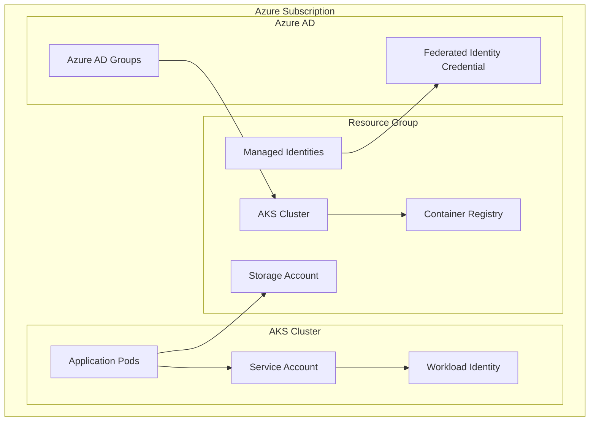

# 🏗️ Infrastructure Documentation

This document provides comprehensive information about the Terraform infrastructure modules and architecture used in the AKS Workload Identity Sample.

## 📋 Table of Contents

1. [Architecture Overview](#architecture-overview)
2. [Module Structure](#module-structure)
3. [Resource Dependencies](#resource-dependencies)
4. [Configuration Guide](#configuration-guide)
5. [Deployment Process](#deployment-process)
6. [Troubleshooting](#troubleshooting)

## 🏛️ Architecture Overview

### High-Level Components



### Resource Relationships

| Component | Purpose | Dependencies |
|-----------|---------|--------------|
| **AKS Cluster** | Kubernetes orchestration platform | Managed Identity, Azure AD Groups |
| **Container Registry** | Container image storage | AKS (pull access) |
| **Storage Account** | Application data storage | Managed Identity (access control) |
| **Managed Identities** | Passwordless authentication | Federated Identity Credentials |
| **Workload Identity** | Pod-to-Azure authentication | Service Account, Managed Identity |

## 📁 Module Structure

### Module Organization
```
infra/tf/modules/
├── aks/                    # AKS cluster configuration
│   ├── main.tf
│   ├── variables.tf
│   └── outputs.tf
├── container_registry/     # Azure Container Registry
│   ├── main.tf
│   ├── variables.tf
│   └── outputs.tf
├── managed_identity/       # Managed identities for workload identity
│   ├── main.tf
│   ├── variables.tf
│   └── outputs.tf
├── storage/               # Storage account for application data
│   ├── main.tf
│   ├── variables.tf
│   └── outputs.tf
└── workload_identity/     # Workload identity configuration
    ├── main.tf
    ├── variables.tf
    └── outputs.tf
```

### Module Descriptions

#### 🚀 AKS Module (`modules/aks/`)
**Purpose**: Creates and configures the Azure Kubernetes Service cluster

**Key Resources**:
- `azurerm_kubernetes_cluster` - Main AKS cluster
- `azurerm_role_assignment` - Azure RBAC for admin groups
- `azurerm_user_assigned_identity` - Cluster managed identity

**Key Features**:
- Azure RBAC integration
- Workload identity enabled
- OIDC issuer configured
- Local accounts disabled
- System-assigned managed identity

**Inputs**:
```hcl
variable "cluster_name" {
  description = "Name of the AKS cluster"
  type        = string
}

variable "admin_group_object_ids" {
  description = "List of Azure AD group object IDs for cluster admin access"
  type        = list(string)
}

variable "kubernetes_version" {
  description = "Kubernetes version for the cluster"
  type        = string
  default     = "1.30.12"
}
```

**Outputs**:
```hcl
output "cluster_id" {
  description = "ID of the AKS cluster"
  value       = azurerm_kubernetes_cluster.aks.id
}

output "oidc_issuer_url" {
  description = "OIDC issuer URL for workload identity"
  value       = azurerm_kubernetes_cluster.aks.oidc_issuer_url
}
```

#### 📦 Container Registry Module (`modules/container_registry/`)
**Purpose**: Creates Azure Container Registry for storing container images

**Key Resources**:
- `azurerm_container_registry` - ACR instance
- `azurerm_role_assignment` - AcrPull permissions for AKS

**Key Features**:
- Basic SKU for cost optimization
- AKS pull permissions automatically configured
- Admin user disabled for security

#### 🆔 Managed Identity Module (`modules/managed_identity/`)
**Purpose**: Creates user-assigned managed identities for workload identity

**Key Resources**:
- `azurerm_user_assigned_identity` - Cluster identity
- `azurerm_user_assigned_identity` - Kubelet identity
- `azurerm_user_assigned_identity` - Application identity

**Identity Types**:
1. **Cluster Identity**: Used by AKS control plane
2. **Kubelet Identity**: Used by worker nodes
3. **Application Identity**: Used by workload pods

#### 💾 Storage Module (`modules/storage/`)
**Purpose**: Creates storage account for application data

**Key Resources**:
- `azurerm_storage_account` - Main storage account
- `azurerm_storage_container` - Application data container
- `azurerm_role_assignment` - Storage access permissions

**Key Features**:
- LRS replication for cost optimization
- Hot access tier
- Secure transfer required
- Public access disabled

#### 🔐 Workload Identity Module (`modules/workload_identity/`)
**Purpose**: Configures federated identity credentials for workload identity

**Key Resources**:
- `azurerm_federated_identity_credential` - Links K8s SA to managed identity

**Configuration**:
```hcl
resource "azurerm_federated_identity_credential" "workload_identity" {
  name                = "workload-identity-credential"
  resource_group_name = var.resource_group_name
  audience            = ["api://AzureADTokenExchange"]
  issuer              = var.oidc_issuer_url
  parent_id           = var.user_assigned_identity_id
  subject             = "system:serviceaccount:default:workload-identity-sa"
}
```

## 🔗 Resource Dependencies

### Dependency Graph
```
Resource Group
    ↓
Managed Identities
    ↓
AKS Cluster (depends on cluster identity)
    ↓
Container Registry (depends on AKS for permissions)
    ↓
Storage Account (depends on managed identity for access)
    ↓
Workload Identity (depends on AKS OIDC issuer)
```

### Critical Dependencies

1. **Managed Identity → AKS**: Cluster identity must exist before AKS creation
2. **AKS → Workload Identity**: OIDC issuer URL required for federated credential
3. **Managed Identity → Storage**: Identity needed for storage access permissions
4. **AKS → Container Registry**: Cluster needs pull permissions to ACR

## ⚙️ Configuration Guide

### Required Variables

```hcl
# terraform.tfvars
admin_group_object_ids = [
  "12345678-1234-1234-1234-123456789012"  # Your Azure AD group
]

environment = "dev"
location    = "centralus"
project     = "akswlid"
```

### Optional Variables

```hcl
# Advanced configuration options
kubernetes_version = "1.30.12"
node_count        = 3
vm_size           = "Standard_B2s"
disk_size_gb      = 30

# Storage configuration
storage_account_tier             = "Standard"
storage_account_replication_type = "LRS"

# Container registry configuration
acr_sku = "Basic"
```

### Environment-Specific Configuration

#### Development Environment
```hcl
environment  = "dev"
node_count   = 1
vm_size      = "Standard_B2s"
disk_size_gb = 30
acr_sku      = "Basic"
```

#### Production Environment
```hcl
environment  = "prod"
node_count   = 3
vm_size      = "Standard_D2s_v3"
disk_size_gb = 100
acr_sku      = "Premium"
```

## 🚀 Deployment Process

### 1. Prerequisites
```bash
# Ensure Azure CLI is logged in
az login
az account set --subscription "your-subscription-id"

# Verify Terraform installation
terraform version
```

### 2. Backend Configuration
```bash
# Copy backend template
cp backend.hcl.template backend.hcl

# Edit backend configuration
vim backend.hcl
```

### 3. Variable Configuration
```bash
# Copy and edit variables
cp terraform.tfvars.example terraform.tfvars
vim terraform.tfvars
```

### 4. Deployment Steps
```bash
# Initialize Terraform
terraform init -backend-config=backend.hcl

# Plan deployment
terraform plan -out=deployment.tfplan

# Apply configuration
terraform apply deployment.tfplan
```

### 5. Post-Deployment Validation
```bash
# Get cluster credentials
az aks get-credentials --resource-group <rg-name> --name <cluster-name>

# Verify cluster access
kubectl get nodes

# Test workload identity
kubectl apply -f ../../examples/test-storage-access.yaml
```

## 🔧 Troubleshooting

### Common Issues

#### 1. Backend Storage Account Access
**Symptom**: `403 Forbidden` when accessing Terraform state
**Solution**:
```bash
# Check your Azure account
az account show

# Verify storage account access
az storage account show --name <storage-account> --resource-group <rg>

# Update backend configuration
az storage account keys list --name <storage-account> --resource-group <rg>
```

#### 2. Azure AD Group Object ID
**Symptom**: `Invalid group object ID` during plan/apply
**Solution**:
```bash
# Find correct group object ID
az ad group show --group "Your-Group-Name" --query id --output tsv

# Verify group exists
az ad group list --display-name "Your-Group-Name"
```

#### 3. AKS API Server Access
**Symptom**: Cannot connect to AKS cluster after deployment
**Solution**:
```bash
# Get fresh credentials
az aks get-credentials --resource-group <rg> --name <cluster> --overwrite-existing

# Install kubelogin for Azure AD authentication
az aks install-cli

# Convert kubeconfig for Azure AD
kubelogin convert-kubeconfig -l azurecli
```

#### 4. Workload Identity Not Working
**Symptom**: Pods cannot authenticate to Azure services
**Solution**:
```bash
# Verify service account exists
kubectl get serviceaccount workload-identity-sa

# Check federated identity credential
az identity federated-credential list \
  --name <identity-name> \
  --resource-group <rg>

# Verify pod has correct annotations
kubectl get pod <pod-name> -o yaml | grep azure.workload.identity
```

### Debugging Commands

#### Check Resource Status
```bash
# AKS cluster status
az aks show --name <cluster-name> --resource-group <rg> --query "powerState"

# Storage account access
az storage account show --name <storage-account> --resource-group <rg>

# Managed identity details
az identity show --name <identity-name> --resource-group <rg>
```

#### Terraform Debugging
```bash
# Enable detailed logging
export TF_LOG=DEBUG

# Plan with detailed output
terraform plan -detailed-exitcode

# Show state
terraform show

# Refresh state
terraform refresh
```

### Performance Optimization

#### Resource Sizing
- **Development**: Use `Standard_B2s` VMs for cost optimization
- **Production**: Use `Standard_D2s_v3` or higher for performance
- **Storage**: Use `Standard_LRS` for development, `Standard_ZRS` for production

#### Cost Optimization
- Enable AKS cluster autoscaling for variable workloads
- Use spot instances for development environments
- Configure storage lifecycle policies
- Monitor and optimize container registry usage

## 📊 Monitoring and Observability

### Key Metrics to Monitor
- AKS cluster health and node status
- Workload identity authentication success/failure rates
- Storage account access patterns
- Container registry pull metrics

### Recommended Monitoring Tools
- Azure Monitor for infrastructure metrics
- Container Insights for AKS observability
- Azure AD sign-in logs for authentication monitoring
- Terraform state monitoring for drift detection

---

📚 **Related Documentation**:
- [Network Workflow](../../docs/network-workflow.md) - **Detailed pod-to-storage network flow analysis**
- [Private Storage Architecture](../../docs/private-storage-architecture.md) - Private endpoint design
- [Azure AD Admin Groups](../../docs/azure-ad-admin-groups.md) - Admin access configuration
- [Azure Federated Token File](../../docs/azure-federated-token-file.md) - Token mechanism deep dive
- [Examples & Testing](../../examples/README.md) - Validation and troubleshooting
- [Main README](../../README.md) - Complete project documentation
